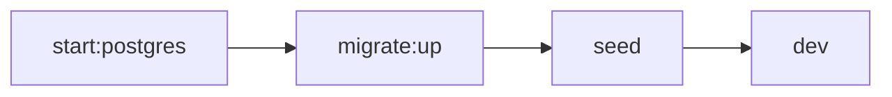
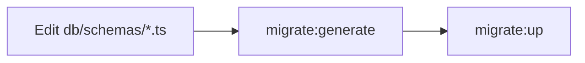

# Fadhlidev Workspace

Dashboard Workspace — built with Next.js 16 App Router + Elysia.

## Prerequisites

- [Bun](https://bun.sh) >= 1.2
- Docker (for PostgreSQL)

## Getting Started

**1. Start PostgreSQL**

```bash
npm run start:postgres
# or with pgAdmin:
npm run start:pgadmin
```

**2. Environment**

`.env.local` is pre-configured for local development.

**3. Run migrations**

```bash
npm run migrate:up
```

**4. Seed default admin user**

```bash
npm run seed
```

**5. Start dev server**

```bash
npm run dev
```

Open [http://localhost:3000](http://localhost:3000).

> **Login:** `admin` / `p4ssw0rD`

## Scripts Reference

| Command | Description |
|---|---|
| `npm run dev` | Start Next.js dev server with hot-reload |
| `npm run build` | Production Next.js build |
| `npm run start` | Start production server |
| `npm run lint` | Run ESLint |
| `npm run start:postgres` | Start PostgreSQL container via Docker Compose |
| `npm run start:pgadmin` | Start PostgreSQL + pgAdmin (UI) |
| `npm run stop:postgres` | Stop PostgreSQL container |
| `npm run stop:pgadmin` | Stop PostgreSQL + pgAdmin containers |
| `npm run migrate:generate` | Generate SQL migration from Drizzle schema changes |
| `npm run migrate:up` | Apply pending migrations to database |
| `npm run migrate:down` | Drop all tables, regenerate, then re-apply migrations |
| `npm run seed` | Seed database with initial data (default admin user) |

### Dev Setup Order



1. **`start:postgres`** — Start the database
2. **`migrate:up`** — Apply schema to database
3. **`seed`** — Insert initial data (admin user)
4. **`dev`** — Start coding

### When Schema Changes



1. Edit schema files in `db/schemas/`
2. `npm run migrate:generate` → produces new SQL file in `db/migrations/`
3. `npm run migrate:up` → apply to database

## Tech Stack

| Layer | Technology |
|---|---|
| Framework | Next.js 16 App Router |
| API Server | Elysia 1.x |
| ORM | Drizzle ORM + drizzle-kit |
| Database | PostgreSQL 17 |
| Auth | NextAuth v4 (Credentials) + JWT |
| UI | MUI v9 + Tailwind v4 |
| State | TanStack Query + Zustand |
