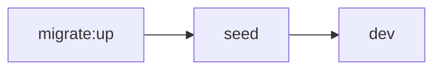
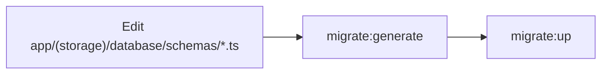

# Fadhlidev Workspace

Dashboard Workspace — built with Next.js 16 App Router + Elysia.

## Prerequisites

- [Bun](https://bun.sh) >= 1.2
- Container runtime ([Docker](https://docs.docker.com/get-docker/) or [Podman](https://podman.io)) — for production-like runs

## Getting Started

**1. Environment**

`.env.local` is pre-configured for local development. Make sure your PostgreSQL instance is reachable (adjust connection settings as needed).

**2. Run migrations**

```bash
npm run migrate:up
```

**3. Seed default admin user**

```bash
npm run seed
```

**4. Start dev server**

```bash
npm run dev
```

Open [http://localhost:3000](http://localhost:3000).

> **Login:** `admin` / `p4ssw0rD`

### Running in a Container

Build the production image and run it via Docker or Podman (auto-detected):

```bash
npm run dockerize   # build image fadhlidev-dashboard:<version>
npm run start       # run the container (uses .env, host network)
```

## Scripts Reference

| Command                    | Description                                           |
| -------------------------- | ----------------------------------------------------- |
| `npm run dev`              | Start Next.js dev server with hot-reload              |
| `npm run build`            | Production Next.js build                              |
| `npm run start`            | Run the built image in a container                    |
| `npm run dockerize`        | Build the production Docker/Podman image              |
| `npm run lint`             | Run ESLint                                            |
| `npm run format`           | Format code with Prettier                             |
| `npm run migrate:generate` | Generate SQL migration from Drizzle schema changes    |
| `npm run migrate:up`       | Apply pending migrations to database                  |
| `npm run migrate:down`     | Drop all tables, regenerate, then re-apply migrations |
| `npm run seed`             | Seed database with initial data (default admin user)  |

### Dev Setup Order



1. **`migrate:up`** — Apply schema to database
2. **`seed`** — Insert initial data (admin user)
3. **`dev`** — Start coding

### When Schema Changes



1. Edit schema files in `app/(storage)/database/schemas/`
2. `npm run migrate:generate` → produces new SQL file in `app/(storage)/database/migrations/`
3. `npm run migrate:up` → apply to database

## Project Structure

```
app/
├── (backend)/            # Server-side code (Elysia)
│   ├── api/              # API route handlers
│   ├── modules/          # Feature modules (auth, management, profile, rbac)
│   └── plugins/          # Elysia plugins (jwt, permission, rate-limit)
├── (frontend)/           # Client-side code
│   ├── (pages)/          # Route pages (login, management, me)
│   ├── components/       # UI components (common, layout, styled, ui)
│   ├── configs/          # Frontend configs (menus)
│   ├── hooks/            # Custom hooks (menu, permissions, profile)
│   ├── providers/        # Context providers
│   └── styles/           # Theme & fonts
├── (shared)/             # Code shared between frontend & backend
│   ├── helpers/
│   └── types/
└── (storage)/            # Persistence layer
    └── database/         # Drizzle setup
        ├── helpers/
        ├── migrations/
        └── schemas/
scripts/                 # Automation (dockerize, containerized start)
```

Route groups (`(backend)`, `(frontend)`, etc.) don't affect URL paths — they only organize the folder layout.

## Tech Stack

| Layer      | Technology                      |
| ---------- | ------------------------------- |
| Framework  | Next.js 16 App Router           |
| API Server | Elysia 1.x                      |
| ORM        | Drizzle ORM + drizzle-kit       |
| Database   | PostgreSQL                      |
| Auth       | NextAuth v4 (Credentials) + JWT |
| UI         | MUI v9 + Tailwind v4            |
| State      | TanStack Query + Zustand        |
| Validation | Zod                             |

> **Note:** This project uses **Bun** as its runtime — prefer `bun run <script>` if available, though `npm run` works too.
